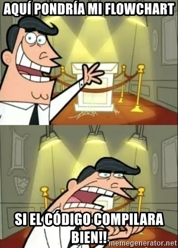

<h1>Simple Shell</h1>
Release date April 11, 2022
</p>

## Table of Contents
* [Requirements](#Requirements)
    * Output
* [Functions and system calls](#functions-and-system-calls)
* [Files](#Files)
* [GCC command to compile](#gcc-command-to-compile)
* [Flowchart](#flowchart)
* [Authors](#authors)

## Requirements
 * Allowed editors: vi, vim, emacs
 * All your files will be compiled on `Ubuntu 20.04 LTS`<a href="https://ubuntu.com/" target="_blank"> </a> using `gcc`, using the options `-Wall` `-Werror` `-Wextra` and `-pedantic`
 * All your files should end with a new line
 * A README.md file, at the root of the folder of the project is mandatory
 * Your code should use the `Betty` style. It will be checked using [betty-style.pl](https://github.com/holbertonschool/Betty/blob/master/betty-style.pl) and [betty-doc.pl](https://github.com/holbertonschool/Betty/blob/master/betty-doc.pl)
 * Your shell should not have any memory leaks
 * No more than 5 functions per file
 * All your header files should be include guarded
 * Use system calls only when you need to ([why?](https://www.quora.com/Why-are-system-calls-expensive-in-operating-systems))


 ### Output
* Unless specified otherwise, your program **must have the exact same output** as sh (/bin/sh) as well as the exact same error output.
* The only difference is when you print an error, the name of the program must be equivalent to your argv[0] (See below)

* Example of error with sh:
```
$ echo "qwerty" | /bin/sh
/bin/sh: 1: qwerty: not found
$ echo "qwerty" | /bin/../bin/sh
/bin/../bin/sh: 1: qwerty: not found
$
```
Same error with your program `hsh` :
```
$ echo "qwerty" | ./hsh
./hsh: 1: qwerty: not found
$ echo "qwerty" | ./././hsh
./././hsh: 1: qwerty: not found
$
```
 ## Functions and system calls
* `access` (man 2 access)
* `chdir` (man 2 chdir)
* `close` (man 2 close)
* `closedir` (man 3 closedir)
* `execve` (man 2 execve)
* `exit` (man 3 exit)
* `_exit` (man 2 _exit)
* `fflush` (man 3 fflush)
* `fork` (man 2 fork)
* `free` (man 3 free)
* `getcwd` (man 3 getcwd)
* `getline` (man 3 getline)
* `getpid` (man 2 getpid)
* `isatty` (man 3 isatty)
* `kill` (man 2 kill)
* `malloc` (man 3 malloc)
* `open` (man 2 open)
* `opendir` (man 3 opendir)
* `perror` (man 3 perror)
* `read` (man 2 read)
* `readdir` (man 3 readdir)
* `signal` (man 2 signal)
* `stat` (__xstat) (man 2 stat)
* `lstat` (__lxstat) (man 2 lstat)
* `fstat` (__fxstat) (man 2 fstat)
* `strtok` (man 3 strtok)
* `wait` (man 2 wait)
* `waitpid` (man 2 waitpid)
* `wait3` (man 2 wait3)
* `wait4` (man 2 wait4)
* `write` (man 2 write)

### Files

|File|Description|
|---|---|
|[shell.h](https://github.com/UCIX210/simple_shell/blob/main/shell.h)|Prototypes functions and headers|
|[shell.c](https://github.com/UCIX210/simple_shell/blob/main/shell.c)|Main arguments|
|[prompt.c](https://github.com/UCIX210/simple_shell/blob/main/prompt.c)|FILE|
|[_print$.c](https://github.com/UCIX210/simple_shell/blob/main/_print%24.c)|Write a '$' in the terminal|
|[_typed_by_user](https://github.com/UCIX210/simple_shell/blob/main/_typed_by_user.c)|Receives what is written by the user and saves it in a string|
|[tokenize.c](https://github.com/UCIX210/simple_shell/blob/main/tokenize.c)|Tokenize or split the string by spaces, in substrings save them in an array|
|[AUTHORS](https://github.com/UCIX210/simple_shell/blob/main/AUTHORS)|Contributors in this repository|
|[README.md](https://github.com/UCIX210/simple_shell/blob/main/README.md)|Information about our repository|

## GCC command to compile
```
gcc -Wall -Werror -Wextra -pedantic *.c -o hsh
```
## Flowchart



## Authors

<li><a href="https://github.com/UCIX210">Javier Uc Ix</a></li>
<li><a href="https://github.com/Dsolis0428">Dylan Solis Martins</a></li>
